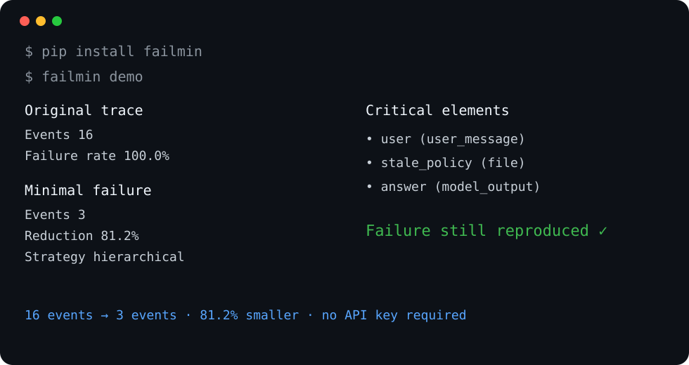

# FailMin

**Minimize long AI / Agent failures into small reproducible traces.**

[English](README.md) | [简体中文](README.zh-CN.md)

[](https://pypi.org/project/failmin/)
[](https://pypi.org/project/failmin/)
[](https://github.com/xxPcy/failmin/actions/workflows/tests.yml)
[](LICENSE)

```bash
pip install failmin
failmin demo
```



FailMin applies **delta debugging** to AI workflows. It repeatedly removes messages, tool calls, retrieval results, files, and other trace events, replays the candidate, and keeps only reductions that still reproduce the failure.

Think **`git bisect` + delta debugging, but for LLM/Agent traces**.

> Which parts of this long run are actually necessary for the failure to happen?

---

## Why this exists

AI failures are often buried inside large traces:

- an agent calls 20 tools before producing one wrong answer;
- a RAG pipeline retrieves 30 chunks, but one stale chunk causes the failure;
- a long prompt contains one conflicting instruction;
- a coding agent touches many files before a regression appears;
- multi-turn context contains stale or contradictory information.

Observability tells you **what happened**. FailMin tries to find the **smallest failure-inducing context**.

---

## 60-second demo

The built-in demo is deterministic and requires **no API key** and **no network access**:

```bash
pip install failmin
failmin demo
```

Typical output:

```text
Original trace
Events        16
Failure rate  100.0%

Minimal failure
Events         3
Reduction     81.2%
Strategy      hierarchical

Critical elements:
- user (user_message)
- stale_policy (file)
- answer (model_output)

Failure still reproduced ✓
```

Try your own Generic JSON trace:

```bash
failmin minimize examples/trace.json \
  --output-contains "30 days" \
  --strategy hierarchical \
  --out minimal-trace.json \
  --report-json failmin-report.json \
  --report-html failmin-report.html
```

---

## What works today

- Framework-neutral `Trace` / `TraceEvent` schema
- Dependency validation and dependency-preserving reduction
- Dependency-aware `ddmin`
- Hierarchical coarse-to-fine minimization
- Probabilistic reproduction with `runs` + `threshold`
- Replay-decision cache
- Output / exception / callback predicates
- Generic JSON import/export
- JSON and self-contained HTML reports
- Zero-config CLI demo
- Python API for custom frameworks
- Python 3.10–3.13 CI

---

## Python API

The smallest integration boundary is a replay function plus a failure predicate:

```python
from failmin import RunResult, Trace, minimize


def replay(trace: Trace) -> RunResult:
    result = run_my_agent(trace)
    return RunResult(output=result.text)


result = minimize(
    items=my_trace,
    replay=replay,
    failure=lambda result: result.output == "wrong answer",
    runs=5,
    threshold=0.8,
)

print([event.id for event in result.minimal.events])
```

FailMin does not need to know your framework as long as you can convert a run into a `Trace` and replay a candidate trace.

---

## Generic trace format

```json
{
  "schema_version": "0.2",
  "events": [
    {
      "id": "message_10",
      "type": "user_message",
      "input": "What is the refund period?",
      "dependencies": [],
      "metadata": {}
    },
    {
      "id": "policy_1",
      "type": "file",
      "output": "Refund period is 30 days.",
      "dependencies": [],
      "metadata": {"group": "policy_context"}
    },
    {
      "id": "answer_1",
      "type": "model_output",
      "output": "30 days",
      "dependencies": ["message_10", "policy_1"],
      "metadata": {}
    }
  ]
}
```

---

## Non-deterministic failures

LLM/Agent runs are not always deterministic. A candidate can fail once and succeed on the next run.

```python
result = minimize(
    items=my_trace,
    replay=replay,
    failure=is_failure,
    runs=5,
    threshold=0.8,
)
```

This treats a candidate as failure-inducing only when the configured fraction of replays fail. Expensive candidate evaluations are cached during minimization.

---

## Hierarchical reduction

Trace events often have natural groups: one retrieved document, one agent turn, one tool-call/result bundle, or one workspace file. Add a group in metadata:

```json
{
  "id": "chunk_7",
  "type": "retrieval_result",
  "metadata": {"group": "document_refund_policy"}
}
```

Then:

```bash
failmin minimize trace.json \
  --output-contains "wrong answer" \
  --strategy hierarchical
```

FailMin first tries coarse removals and then refines the surviving subset.

---

## Reports

```bash
failmin minimize trace.json \
  --output-contains "wrong answer" \
  --report-json failmin-report.json \
  --report-html failmin-report.html
```

Reports include reduction statistics, replay counts, failure rate, critical elements, dependencies, and the minimal trace.

---

## Architecture

```text
                 FailMin
                    │
        ┌───────────┴───────────┐
        │                       │
     Adapters                  Core
        │                       │
 Generic JSON              Trace Schema
 Framework adapters        Dependency Graph
        │                  Reducers
        │                  Reproduction
        └───────────┬───────────┘
                    │
               Replay Boundary
                    │
             Failure Predicate
                    │
                 Report
```

Design rules:

1. The core stays framework-neutral.
2. Reductions preserve dependencies.
3. A deletion is accepted only after replay verification.
4. Non-determinism is explicit rather than ignored.
5. The first experience works without credentials.

---

## Roadmap

### v0.1 — foundation ✅
- Generic trace model
- failure predicates
- dependency-aware delta debugging
- CLI
- zero-config demo

### v0.2 — reproducibility + reporting ✅
- probabilistic reproduction
- replay cache
- hierarchical reduction
- JSON / HTML reports
- stronger validation

### v0.3 — framework adapters 🚧
- LangGraph adapter
- OpenAI / Agents adapter
- executable replay protocol
- external-state snapshot / mock hooks

### v0.4 — smarter minimization
- LLM-guided candidate ordering
- root-cause explanation
- richer reproduction bundles

### v0.5 — ecosystem
- observability integrations
- trace importers
- adapter/plugin ecosystem

---

## Development

```bash
git clone https://github.com/xxPcy/failmin.git
cd failmin
pip install -e '.[dev]'
pytest
```

Build:

```bash
python -m build
```

Contributions are welcome. See [CONTRIBUTING.md](CONTRIBUTING.md).

Launch/promotion copy for contributors and maintainers lives in [docs/LAUNCH.md](docs/LAUNCH.md).

## License

MIT
